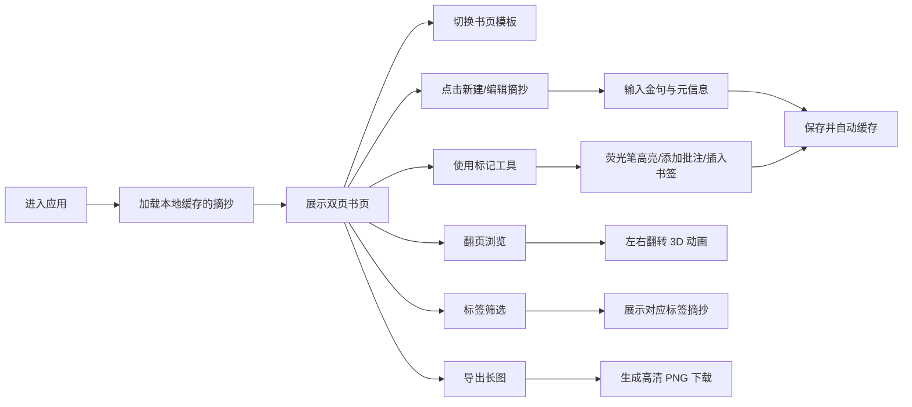

## 1. 产品概述

旧书页文字摘抄工具 —— 一款具有沉浸式纸质质感的读书笔记应用，让用户在模拟古书、笔记本、报纸、信笺的书页上记录书籍金句，享受阅读与书写的宁静。

- 核心价值：通过拟真的纸质纹理与翻页交互，还原实体书摘抄的仪式感，打造低对比度护眼的沉浸式阅读书写体验
- 目标用户：热爱阅读、习惯做书摘、追求审美与仪式感的读者群体
- 产品定位：轻量、唯美、专注的文字记录工具，而非功能繁杂的笔记应用

## 2. 核心功能

### 2.1 功能模块总览

1. **书页模板切换**：泛黄古书、横线笔记本、报纸剪报、信笺四种风格
2. **摘抄编辑**：分段录入金句，附带书名、作者、页码元信息
3. **标记工具**：荧光笔高亮、侧边手写批注、书签标记重点段落
4. **翻页阅读**：左右双页翻转动画，书本开合过渡效果
5. **检索标签**：自定义读书标签（治愈、哲学、诗歌、小说等）筛选
6. **导出与缓存**：整本书摘抄导出为高清长图，草稿自动本地缓存

### 2.2 页面详情

| 页面名称 | 模块名称 | 功能描述 |
|----------|----------|----------|
| 主阅读页 | 双页书页展示 | 左右两页并排呈现，包含纸张纹理、内容排版 |
| 主阅读页 | 书页模板切换器 | 底部悬浮控制，一键切换四种书页风格 |
| 主阅读页 | 摘抄编辑器 | 点击段落进入编辑，输入金句、书名、作者、页码 |
| 主阅读页 | 标记工具栏 | 荧光笔、批注、书签三种标记工具切换 |
| 主阅读页 | 翻页控制 | 左右箭头/点击页边翻页，带 3D 翻转动画 |
| 侧边栏 | 标签筛选 | 标签云展示，点击筛选对应摘抄 |
| 侧边栏 | 摘抄列表 | 按标签/全部展示摘抄条目缩略 |
| 侧边栏 | 导出按钮 | 导出全部摘抄为高清长图 PNG |
| 侧边栏 | 新建摘抄 | 创建新的摘抄条目 |

## 3. 核心流程

## 4. 用户界面设计

### 4.1 设计风格

**整体风格：纸质书卷 · 低对比度护眼**

- **主色调**：米黄色系（纸色）、深棕褐色（文字）、赭石色（强调）
- **辅色**：四种书页各有专属色调
  - 泛黄古书：暖米黄 + 深棕文字
  - 笔记本：米白 + 浅蓝横线 + 深蓝文字
  - 报纸剪报：灰白 + 黑色印刷体 + 红色标题
  - 信笺：奶白 + 浅灰横线 + 墨蓝钢笔字
- **质感**：纸张纹理叠加、轻微噪点、边缘泛黄、折角阴影
- **按钮风格**：极度弱化，融入书页环境，hover 时才显现
- **字体**：
  - 标题：衬线字体（如 Noto Serif SC / Source Han Serif）
  - 正文：宋体/楷体 等有书卷气的字体
  - 批注：手写风格字体
- **布局**：居中对称的书本式布局，左右双页，书脊阴影
- **图标**：线性极简图标，颜色融入背景，低调不抢眼

### 4.2 页面设计概述

| 页面名称 | 模块名称 | UI 元素 |
|----------|----------|---------|
| 主阅读页 | 双页容器 | 3D 透视书本，书脊阴影，左右页对称，纸张纹理叠加 |
| 主阅读页 | 内容区 | 标题（书名+作者）、页码、分段金句、高亮标记、侧边批注、书签 |
| 主阅读页 | 模板切换器 | 底部悬浮横向排列四个小预览图，选中态有描边 |
| 主阅读页 | 标记工具栏 | 右侧悬浮竖排工具图标（荧光笔/批注/书签/编辑） |
| 侧边栏 | 抽屉面板 | 从左侧滑入，毛玻璃背景，包含标签云、摘抄列表、导出按钮 |
| 侧边栏 | 标签云 | 圆角标签，点击选中变深色，多色可选 |
| 编辑弹窗 | 表单 | 大文本框输入金句，小输入框填书名/作者/页码，标签选择器 |

### 4.3 响应式

- **桌面优先**：以 1440px 宽度为基准设计，双页并排完整展示
- **平板适配**：1024px 以下保持双页，但缩小比例
- **手机适配**：768px 以下改为单页展示，翻页变为左右滑动
- **触控优化**：移动端增大可点击区域，支持滑动翻页手势

### 4.4 动效与交互

- **翻页动画**：CSS 3D transform 实现书页沿书脊翻转，带阴影变化
- **书本开合**：初始加载时书本从合拢到打开的动画
- **标记交互**：荧光笔划过时的渐显效果，批注弹出时的淡入缩放
- **微交互**：按钮 hover 轻微上浮，选中态有柔和的过渡
- **过渡节奏**：慢节奏、缓动曲线，营造宁静阅读氛围（0.4-0.6s）
