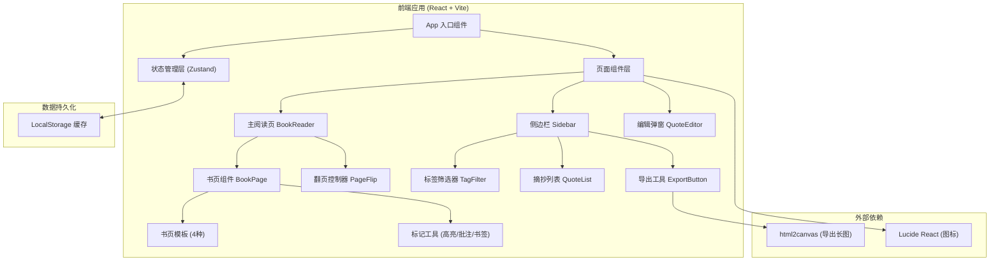
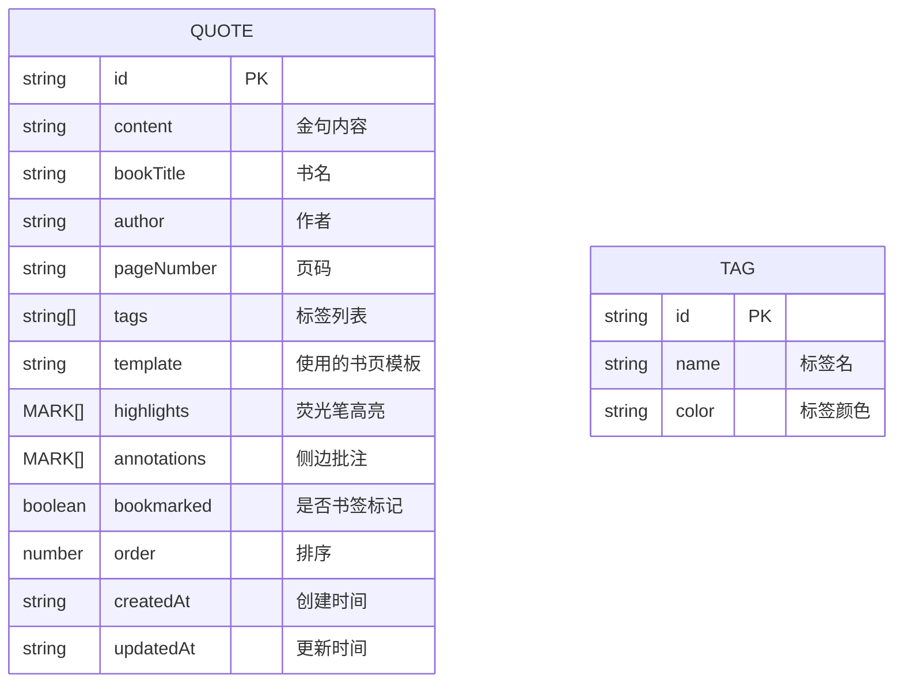

## 1. 架构设计



## 2. 技术栈说明

- **前端框架**：React@18 + TypeScript
- **构建工具**：Vite@5
- **样式方案**：Tailwind CSS@3 + CSS 变量
- **状态管理**：Zustand（轻量、简洁，适合本项目规模）
- **路由**：React Router DOM（单页应用，主页面 + 路由切换预留）
- **图标库**：Lucide React（线性图标，契合极简风格）
- **导出功能**：html2canvas（将 DOM 转为图片导出）
- **数据存储**：LocalStorage（纯前端，自动缓存草稿）

## 3. 目录结构

```
src/
├── components/          # 可复用组件
│   ├── book/           # 书页相关组件
│   │   ├── BookPage.tsx       # 单页书页容器
│   │   ├── BookTemplate.tsx   # 书页模板样式
│   │   ├── PageFlip.tsx       # 翻页动画容器
│   │   └── templates/         # 四种书页模板
│   │       ├── AncientBook.tsx    # 泛黄古书
│   │       ├── Notebook.tsx       # 横线笔记本
│   │       ├── Newspaper.tsx      # 报纸剪报
│   │       └── Letter.tsx         # 信笺
│   ├── editor/         # 编辑相关
│   │   ├── QuoteEditor.tsx      # 摘抄编辑器
│   │   └── Toolbar.tsx          # 标记工具栏
│   ├── marks/          # 标记组件
│   │   ├── Highlighter.tsx      # 荧光笔高亮
│   │   ├── Annotation.tsx       # 侧边批注
│   │   └── Bookmark.tsx         # 书签标记
│   ├── sidebar/        # 侧边栏
│   │   ├── Sidebar.tsx          # 侧边栏容器
│   │   ├── TagFilter.tsx        # 标签筛选
│   │   ├── QuoteList.tsx        # 摘抄列表
│   │   └── ExportButton.tsx     # 导出按钮
│   └── ui/             # 基础 UI 组件
│       ├── Button.tsx
│       ├── Modal.tsx
│       └── Input.tsx
├── hooks/              # 自定义 Hooks
│   ├── useLocalStorage.ts      # 本地存储 Hook
│   ├── useBookState.ts         # 书本状态管理
│   └── useExportImage.ts       # 导出图片 Hook
├── store/              # Zustand 状态
│   └── useQuoteStore.ts        # 摘抄数据 Store
├── types/              # TypeScript 类型
│   └── index.ts
├── utils/              # 工具函数
│   ├── export.ts               # 导出工具
│   └── templateStyles.ts       # 模板样式配置
├── pages/              # 页面组件
│   └── Home.tsx               # 主页面
├── App.tsx
├── main.tsx
└── index.css
```

## 4. 数据模型

### 4.1 数据实体定义



### 4.2 TypeScript 类型定义

```typescript
// 书页模板类型
type BookTemplate = 'ancient' | 'notebook' | 'newspaper' | 'letter';

// 高亮标记
interface Highlight {
  id: string;
  startIndex: number;  // 在正文中的起始字符位置
  endIndex: number;    // 结束字符位置
  color: string;       // 荧光笔颜色
}

// 侧边批注
interface Annotation {
  id: string;
  content: string;     // 批注内容
  position: number;    // 对应正文中的位置
}

// 书签
interface Bookmark {
  id: string;
  quoteId: string;
  position: number;    // 书签位置
}

// 摘抄条目
interface Quote {
  id: string;
  content: string;
  bookTitle: string;
  author: string;
  pageNumber: string;
  tags: string[];       // tag id 列表
  template: BookTemplate;
  highlights: Highlight[];
  annotations: Annotation[];
  bookmarked: boolean;
  order: number;
  createdAt: string;
  updatedAt: string;
}

// 标签
interface Tag {
  id: string;
  name: string;
  color: string;
}

// 应用状态
interface AppState {
  quotes: Quote[];
  tags: Tag[];
  currentQuoteIndex: number;
  currentTemplate: BookTemplate;
  activeTool: 'none' | 'highlight' | 'annotation' | 'bookmark';
  sidebarOpen: boolean;
  filterTagId: string | null;
}
```

## 5. 核心功能实现方案

### 5.1 书页模板切换

- 使用 CSS 变量 + Tailwind 自定义主题，每种模板对应一套 CSS 变量
- 通过给根容器添加 data-template 属性切换样式
- 纸张纹理使用 CSS 渐变 + background-image 叠加实现，减少图片依赖

### 5.2 翻页动画

- 使用 CSS 3D transform（rotateY + perspective）实现书页翻转
- 左右双页分别设置 transform-origin 在书脊侧
- 翻页时配合 opacity 与 box-shadow 变化，增强立体感
- 使用 state 管理当前页码，动画由 CSS transition 完成

### 5.3 荧光笔高亮

- 将文本按字符位置分割为多个 span
- 被高亮的 span 添加半透明背景色，模拟荧光笔效果
- 点击选中文字后弹出工具条，选择颜色即可高亮
- 高亮位置以字符索引存储，重新渲染时自动映射

### 5.4 导出长图

- 使用 html2canvas 将所有摘抄内容渲染为一张长图
- 临时创建一个包含所有书页的 DOM 容器
- 设置高清 scale（2x）以保证导出图片清晰度
- 触发下载保存为 PNG 文件

### 5.5 本地缓存

- 使用 Zustand + persist 中间件，自动将状态持久化到 localStorage
- 防抖保存，避免频繁写入
- 初始化时自动从 localStorage 恢复数据
- 提供清空缓存的入口

## 6. 性能优化

- 列表使用虚拟滚动？暂不使用，因为摘抄内容不会特别多
- 翻页动画使用 transform + opacity，触发 GPU 加速
- 图片资源使用 CSS 生成，无外部图片依赖，加载快
- 组件按需拆分，避免不必要的重渲染
- 使用 useMemo / useCallback 优化渲染性能
